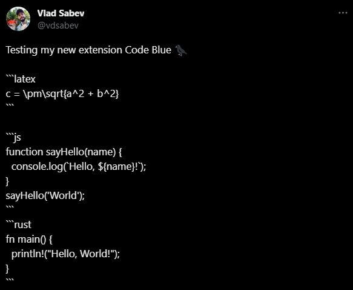

<h1 align="center">
  🐦‍⬛&nbsp;Code Blue
</h1>

<h2 align="center">
  Syntax highlighting for code blocks on X.com
  <br />
  <br />
</h2>

## Demo
### Before


### After


## Local development
1. First, install the dependencies:
    ```bash
    npm install
    ```
2. Then you can start the development server which watches for file changes automatically:
    ```bash
    npm start
    ```
    Or alternatively - only run the build once:
    ```bash
    npm run build
    ```
3. Open the extension list in your browser settings: [chrome://extensions](chrome://extensions)
4. Enable **Developer mode**
5. Click the **Load unpacked** button, navigate to the extension root folder and pick the `build` folder
6. Enjoy!

## Support
If you want to, you may support this project with  Bitcoin:

19UsTZPYtNp1h2y4QT2a7gbNYNZrEdjXvE

<a href="bitcoin:19UsTZPYtNp1h2y4QT2a7gbNYNZrEdjXvE">
  
</a>

<br />
In any case, the extension will remain free and open-source.

## Credits
Inspired by https://x.com/ScriptAlchemist/status/1680788349840228357

## License
See [LICENSE](LICENSE)
